## Part 1.
* Вставьте скриншот с выводом команды. 

## Part 2.
* Вставьте скриншот вызова команды для создания пользователя. 
* Вставьте скриншот с выводом команды. 

## Part 3.
* Задать название машины вида user-1 
* Установить временную зону, соответствующую вашему текущему местоположению 
* Вывести названия сетевых интерфейсов с помощью консольной команды. 
    * Интерфейс "lo" используется для тестирования и настройки сетевых приложений на локальном компьютере, а также для обмена данными между различными сетевыми приложениями на одном и том же компьютере. Например, если вы хотите запустить веб-сервер и протестировать его работу на локальном компьютере, вы можете использовать интерфейс "lo" для доступа к серверу через локальный IP-адрес 127.0.0.1.
    Важно отметить, что интерфейс "lo" не связан с какой-либо физической сетевой картой и не соединен с внешней сетью. Он существует только в операционной системе и используется только для обмена данными между различными сетевыми приложениями на одном компьютере.
* В отчёте дать расшифровку DHCP
    * DHCP (Dynamic Host Configuration Protocol) - это протокол автоматической настройки IP-адресов, который позволяет компьютерам автоматически получать IP-адрес, маску подсети, адрес шлюза и другие настройки сети от DHCP-сервера
* Определить и вывести на экран внешний ip-адрес шлюза (ip) и внутренний IP-адрес шлюза, он же ip-адрес по умолчанию (gw). 
* Задаем статический ip, gw, dns изменением конфигурационного файла находящийся по пути: /etc/netplan/00-installer-config.yaml 
* Успешно пропинговать удаленные хосты 1.1.1.1 и ya.ru и вставить в отчёт скрин с выводом команды. В выводе команды должна быть фраза "0% packet loss". 

## Part 4.
* Чтобы обновить системные пакеты на Ubuntu Server нужно выполнить 2 команды: 
    1)	sudo apt update для обновления списка доступных пакетов;
    2)	sudo apt upgrade для установки обновлений для всех установленных пакетов. 

## Part 5.
* Команда sudo (SuperUser DO) в операционной системе Linux предназначена для предоставления временных привилегий суперпользователя (root) другому пользователю. Это позволяет пользователям выполнять привилегированные задачи, такие как установка программ, изменение конфигурационных файлов и запуск системных служб, без необходимости постоянно работать от имени суперпользователя.
* Чтобы разрешить пользователю выполнять команду sudo его необходимо включить в группу sudo:
    * sudo adduser имя 'пользователя' sudo
* Поменять hostname ОС от имени пользователя, созданного в пункте 

## Part 6.
* Вывести время, часового пояса, в котором вы сейчас находитесь. 
    * Включите автоматическую синхронизацию времени с помощью NTP sudo timedatectl set-timezone Europe/Moscow

## Part 7.
* Используя каждый из трех выбранных редакторов, создайте файл test_X.txt, где X -- название редактора, в котором создан файл.     
    * vim ввести команду :wq, чтобы сохранить изменения и выйти
    * nano "Ctrl" и "O" одновременно, далее "Ctrl" и "X" чтобы выйти из редактора
    * joe "Ctrl" и "K" а затем "Q"
* Используя каждый из трех выбранных редакторов, откройте файл на редактирование, отредактируйте файл, заменив никнейм на строку "21 School 21", закройте файл без сохранения изменений  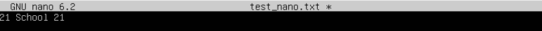 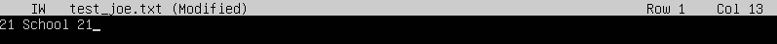
    * vim принудительно выйти из Vim без сохранения изменений, введите команду ":q!"
    * nano "Ctrl" и " X " одновременно, редактор предложит сохранить изменения нажатием клавиши "N" для отказа
    * joe "Ctrl" и "K" а затем "Q" редактор предложит сохранить изменения нажатием клавиши "N" для отказа
* Используя каждый из трех выбранных редакторов, отредактируйте файл ещё раз (по аналогии с предыдущим пунктом), а затем освойте функции поиска по содержимому файла (слово) и замены слова на любое другое.  
    * vim для поиска необходимо в консольном меню ввести ‘/шаблон’, для замены во всем файле :%s/foo/bar/g
    * nano для поиска необходимо нажать клавиши "Ctrl" и "W" одновременно и задать шаблон для поиска
    * joe "Ctrl" и "K" а затем "F"и задать шаблон для поиска, после чего релактор предложит замену

## Part 8.
* Установить службу SSHd 
    * sudo apt install openssh-server
* Добавить автостарт службы при загрузке системы.
    * sudo systemctl enable ssh
* Перенастроить службу SSHd на порт 2022. 
    * Изменить конфигурационный файл SSH-сервера располагаемый по пути /etc/ssh/sshd_config
* Используя команду ps, показать наличие процесса sshd. Для этого к команде нужно подобрать ключи. 
    * Эта команда показывает все процессы, запущенные на системе и фильтрует их через утилиту grep для поиска процесса sshd
* Вывод команды netstat -tan должен содержать 
* Команда netstat -tan показывает список всех активных сетевых соединений (TCP и UDP) на компьютере, а также статистику каждого соединения.
* Расшифровка параметров:
    * t - показывает активные TCP-соединения (Transmission Control Protocol).
    * a - показывает все активные соединения, включая те, что находятся в состоянии ожидания (listening).
    * n - отключает разрешение имен хостов и портов на числовые адреса, что ускоряет работу команды.
Proto - Протокол (tcp, udp, raw), используемый сокетом.
Recv-Q - Счётчик байт не скопированных программой пользователя из этого сокета.
Send-Q - Счётчик байтов, не подтверждённых удалённым узлом.
Local Address - Адрес и номер порта локального конца сокета. Если не указана опция --numeric (-n), адрес сокета преобразуется в каноническое имя узла (FQDN), и номер порта преобразуется в соответствующее имя службы.
Foreign Address - Адрес и номер порта удалённого конца сокета. Аналогично "Local Address."
State - состояние соединения (established - установлено, listening - ожидание, time_wait - закрыто и т.д.).
В выводе команды netstat -tan, 0.0.0.0:* означает, что процесс или служба прослушивает все доступные сетевые интерфейсы на локальной машине.

## Part 9.
* По выводу команды top определить и написать в отчёте 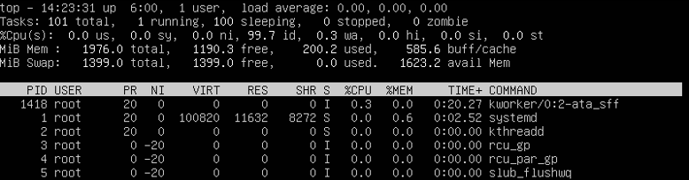
    * uptime 6:00
    * 1 users
    * load average это три значения, разделенные запятой, которые показывают загрузку системы за последние 1, 5 и 15 минут соответственно. Например, "0.00, 0.00, 0.00" означает, что средняя загрузка системы за последние 1, 5 и 15 минут составляет 0.0, 0.0 и 0.00 соответственно.
    * 101 total означает, что в системе запущено 101 процесса
    * "0.0%us, 0.0%sy, 0.0%ni, 99.7%id, 0.3%wa, 0.0%hi, 0.0%si, 0.0%st" означает, что процессор загружен на 0% пользовательскими процессами (us), на 0% системными процессами (sy), на 0 % процессами, запущенными с измененным приоритетом (ni), 99.7% процессами в ожидании (id), на 0.3% операциями ввода-вывода (wa) и на 0% аппаратными прерываниями (hi) и 0% сигналами (si)
    * 1976 total, 1190.3 free, 200.2 used, 585.6 buff/cache означает, что 1976.0 память всего, 1190.3 из неё свободно, 200.2 используется и 585.6 занято буфером и кэшом
* Для того чтобы отсортировывать по используемой памяти нужно нажать клавишу "Shift+m" либо "M" и процессы будут отсортированы по использованию памяти в убывающем порядке 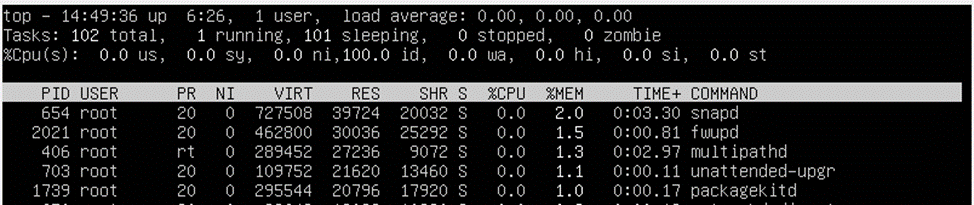
* Для того чтобы отсортировывать по по времени работы процесса нужно нажать клавишу "Shift+t" либо "T" и процессы будут отсортированы по времени работы процесса в убывающем порядке 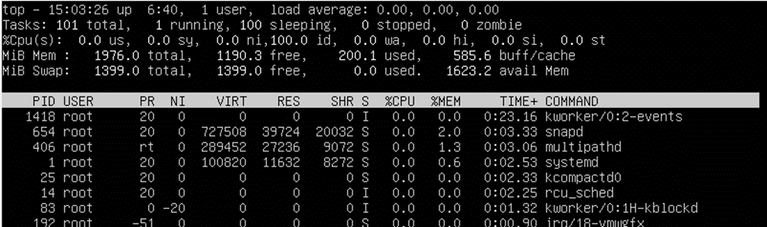
* Нажать клавишу "F6" для открытия списка опций сортировки, выбрать необходимый критерий, после нажать "Shift"+ "F6" для добавления нового критерия сортировки. После чего процессы будут отсортированы по первому критерию, а затем по второму и т.д. 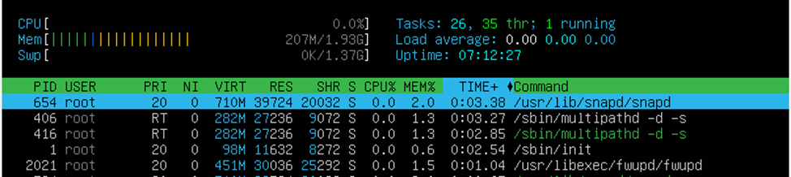
* htop -p $(pgrep sshd) здесь мы использовали опцию -p для фильтрации процессов, отображая только процесс sshd 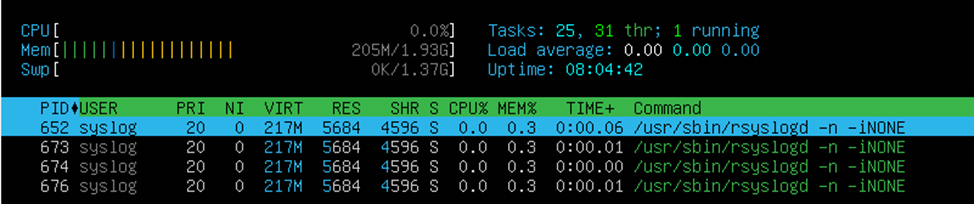

## Part 10.
* Название жесткого диска: /dev/sda, размер 10 gib, 20971520 секторов, размер swap раздела 1.8 gib 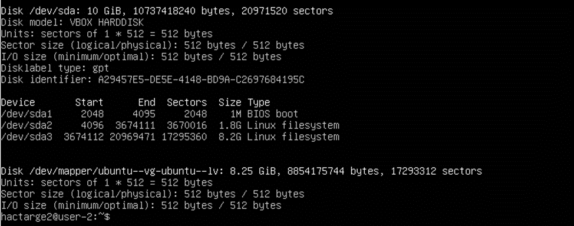
* Есть три раздела:
    * загрузочный раздел / dev / sdb1
    * swap раздел / dev / sdb2
    * Корневой раздел / dev / sdb3

## Part 11.
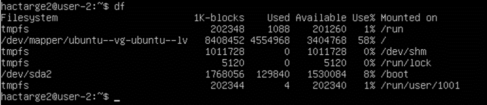
* размер раздела – 8408452 kb, размер занятого пространства – 4554968 kb, размер свободного пространства 3404768 kb, процент использования – 58%
* 1K-блок - это единица измерения размера блока в файловых системах. Он равен 1024 байтам или 1 кибибайту
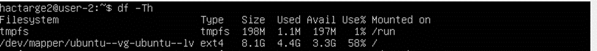
* размер раздела – 8.1 gb, размер занятого пространства – 4.4 gb, размер свободного пространства 3.4 gb, процент использования – 58%
* ext4 - это файловая система, используемая в операционной системе Linux

## Part 12.
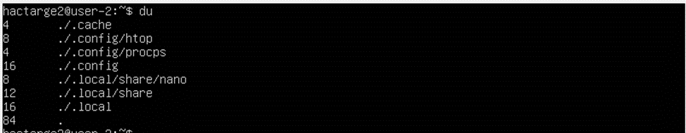
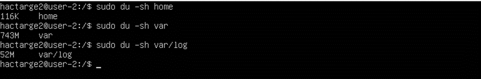
* Опция «s» выводить только общий размер, опция «h» выводит размер в единицах измерения удобных для человека
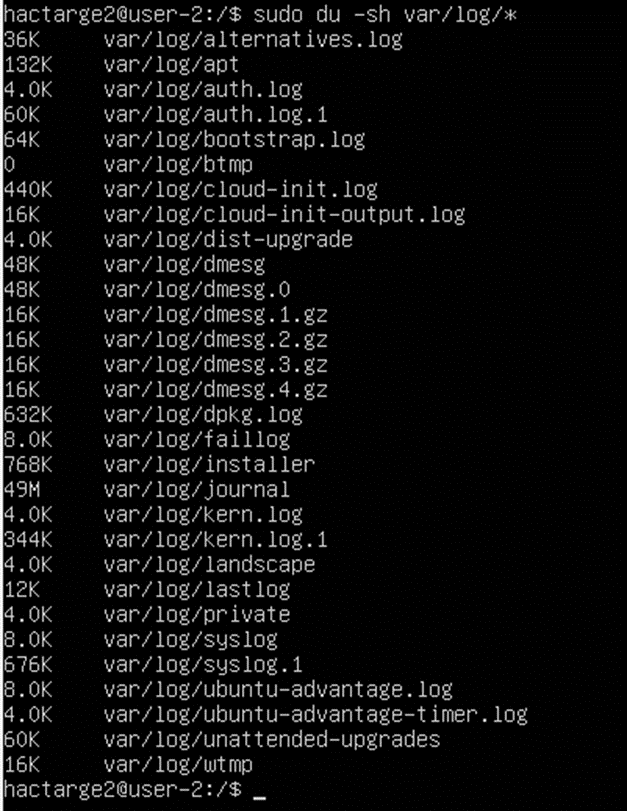

## Part 13.
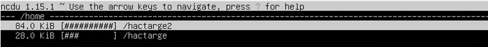

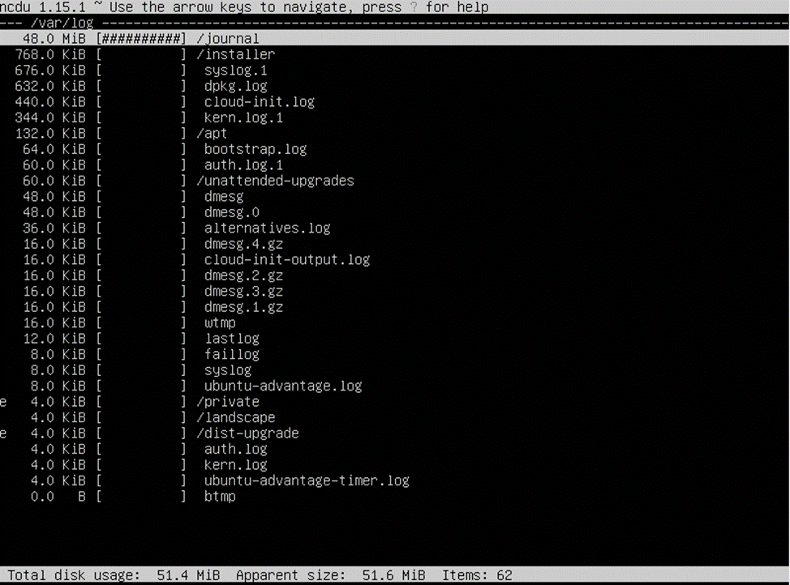

## Part 14.
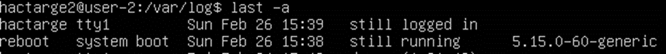
* Для проверки последней успешной авторизации, имени пользователя и метода входа в систему в Linux можно использовать команду last с опцией -a
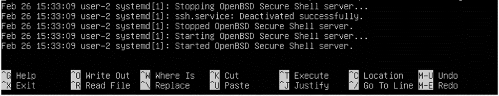
* Перезагрузка службы sshd, находится в /var/log/syslog

## Part 15.

* Открываем редактор заданий CRON с помощью команды crontab –e
* Добавить новую запись в файл crontab вида: */2 * * * * uptime
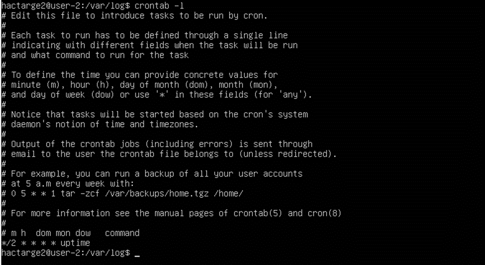
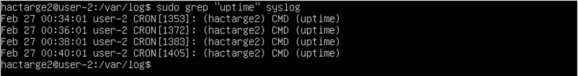
* Чтобы удалить все задания из планировщика заданий cron, выполним команду crontab -r
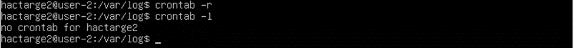