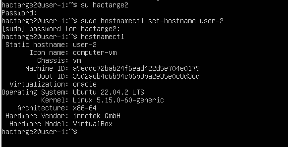
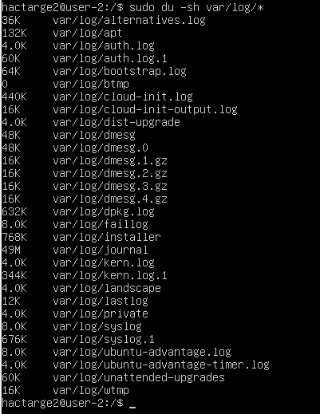
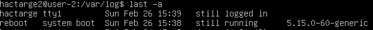

**Part 4. Обновление ОС**

Чтобы обновить системные пакеты на Ubuntu Server нужно выполнить 2 команды: 

1) sudo apt update для обновления списка доступных пакетов;
1) sudo apt upgrade для установки обновлений для всех установленных пакетов.

**Part 5. Использование команды sudo**

Команда **sudo** (SuperUser DO) в операционной системе Linux предназначена для предоставления временных привилегий суперпользователя (root) другому пользователю. Это позволяет пользователям выполнять привилегированные задачи, такие как установка программ, изменение конфигурационных файлов и запуск системных служб, без необходимости постоянно работать от имени суперпользователя.

Чтобы разрешить пользователю выполнять команду sudo его необходимо включить в группу sudo:

sudo adduser имя пользователя sudo

Поменять hostname ОС от имени пользователя, созданного в пункте Part 2 (используя sudo).

Необходимо переключится на пользователя hactarge2 и под этим пользователем выполнить команду sudo hostnamectl set-hostname «имя хоста»

**Part 6. Установка и настройка службы времени**

проверить статус синхронизации времени, выполнив команду:

Включите автоматическую синхронизацию времени с помощью NTP

sudo timedatectl set-timezone Europe/Moscow

**Part 7. Установка и использование текстовых редакторов**

Для того чтобы выйти с сохранением, необходимо "Esc", чтобы переключиться в режим команд, ввести команду :wq, чтобы сохранить изменения и выйти.

Для того чтобы сохранить изменения в файле, необходимо нажать клавиши "Ctrl" и "O" одновременно, далее "Ctrl" и "X" чтобы выйти из редактора.

Для того чтобы сохранить изменения в файле, необходимо нажать клавиши "Ctrl" и "K" а затем "Q" в случае если в файле были сделаны изменения, то будет предложено сохранить их, иначе редактор просто закроется.

Принудительно выйти из Vim без сохранения изменений, введите команду ":q!"

Для того чтобы выйти из файла без сохранения, необходимо нажать клавиши "Ctrl" и " X " одновременно, редактор предложит сохранить изменения нажатием клавиши "N" для отказа.

Для того чтобы выйти из файла без сохранения, необходимо нажать клавиши "Ctrl" и "K" а затем "Q" редактор предложит сохранить изменения нажатием клавиши "N" для отказа.

Для поиска необходимо в консольном меню ввести ‘/шаблон’

Чтобы найти первое вхождение строки ‘foo’ в текущей строке и заменить его на ‘bar’, вы должны использовать:

- s/foo/bar/

Чтобы заменить все вхождения шаблона поиска в текущей строке, добавьте флаг g:

- :s/foo/bar/g

Если вы хотите найти и заменить шаблон во всем файле, используйте процентный символ % в качестве диапазона. Этот символ указывает диапазон от первой до последней строки файла:

- :%s/foo/bar/g

Для поиска необходимо нажать клавиши "Ctrl" и "W" одновременно и задать шаблон для поиска.

 Для поиска и замены слов необходимо нажать клавиши "Ctrl" и "\" одновременно, задать шаблон для поиска и шаблон замены.

**Part 8. Установка и базовая настройка сервиса SSHD**

Установить пакет OpenSSH-server, который включает в себя службу SSHd, выполнив команду: sudo apt install openssh-server

Активировать службу SSHd, чтобы она запускалась автоматически при загрузке системы, выполнив команду: sudo systemctl enable ssh

Для того чтобы перенастроить службу sshd на порт 2022 необходимо изменить конфигурационный файл SSH-сервера располагаемый по пути /etc/ssh/sshd\_config, сохранить файл. Далее следует перезапустить демон SSH. Выполните команду: sudo systemctl restart sshd

Эта команда показывает все процессы, запущенные на системе и фильтрует их через утилиту grep для поиска процесса sshd

Команда netstat -tan показывает список всех активных сетевых соединений (TCP и UDP) на компьютере, а также статистику каждого соединения.

Расшифровка параметров:

- t - показывает активные TCP-соединения (Transmission Control Protocol).
- a - показывает все активные соединения, включая те, что находятся в состоянии ожидания (listening).
- n - отключает разрешение имен хостов и портов на числовые адреса, что ускоряет работу команды.

Proto - Протокол (tcp, udp, raw), используемый сокетом.

Recv-Q - Счётчик байт не скопированных программой пользователя из этого сокета.

Send-Q - Счётчик байтов, не подтверждённых удалённым узлом.

Local Address - Адрес и номер порта локального конца сокета. Если не указана опция --numeric (-n), адрес сокета преобразуется в каноническое имя узла (FQDN), и номер порта преобразуется в соответствующее имя службы.

Foreign Address - Адрес и номер порта удалённого конца сокета. Аналогично "Local Address."

State - состояние соединения (established - установлено, listening - ожидание, time\_wait - закрыто и т.д.).

В выводе команды netstat -tan, 0.0.0.0:\* означает, что процесс или служба прослушивает все доступные сетевые интерфейсы на локальной машине.

**Part 9. Установка и использование утилит top, htop**

По выводу команды top можно получить следующую информацию:

- uptime: время работы системы можно увидеть в верхней строке вывода команды top под названием "up". Например, "14:23:31" означает, что система работает уже 14 часов 23 минуты и 31 секунду.
- Количество авторизованных пользователей можно увидеть в верхней строке вывода команды top под названием "users". Например, "1 users" означает, что на данный момент в системе залогинены 1 пользователя.
- Общую загрузку системы можно увидеть в верхней строке вывода команды top под названием "load average". Это три значения, разделенные запятой, которые показывают загрузку системы за последние 1, 5 и 15 минут соответственно. Например, "0.00, 0.00, 0.00" означает, что средняя загрузка системы за последние 1, 5 и 15 минут составляет 0.0, 0.0 и 0.00 соответственно.
- Общее количество процессов можно увидеть в верхней строке вывода команды top под названием "Tasks". Например, "101 total" означает, что в системе запущено 101 процесса.
- Загрузку CPU можно увидеть в верхней части вывода команды top в строке "Cpu(s)". Здесь отображается информация о процессоре, включая общую загрузку процессора в процентах и загрузку каждого ядра процессора. Например, "0.0%us, 0.0%sy, 0.0%ni, 99.7%id, 0.3%wa, 0.0%hi, 0.0%si, 0.0%st" означает, что процессор загружен на 0% пользовательскими процессами (us), на 0% системными процессами (sy), на 0 % процессами, запущенными с измененным приоритетом (ni), 99.7% процессами в ожидании (id), на 0.3% операциями ввода-вывода (wa) и на 0% аппаратными прерываниями (hi) и 0% сигналами (si).
- Загрузка памяти отображается в верхней части вывода команды top и включает информацию о всей доступной памяти, используемой памяти и свободной памяти. Например, 1976 total, 1190.3 free, 200.2 used, 585.6 buff/cache означает, что 1976.0 память всего, 1190.3 из неё свободно, 200.2 используется и 585.6 занято буфером и кэшом.

Для того чтобы отсортировывать по используемой памяти нужно нажать клавишу "Shift+m" либо "M" и процессы будут отсортированы по использованию памяти в убывающем порядке.

Для того чтобы отсортировывать по по времени работы процесса нужно нажать клавишу "Shift+t" либо "T" и процессы будут отсортированы по времени работы процесса в убывающем порядке.

Нажать клавишу "F6" для открытия списка опций сортировки, выбрать необходимый критерий, после нажать "Shift"+ "F6" для добавления нового критерия сортировки. После чего процессы будут отсортированы по первому критерию, а затем по второму и т.д.

Здесь мы использовали опцию -p для фильтрации процессов, отображая только процесс sshd.

**Part 10. Использование утилиты fdisk**

В отчёте написать название жесткого диска, его размер и количество секторов, а также размер swap.

Есть три раздела:

- загрузочный раздел / dev / sdb1
- swap раздел / dev / sdb2

- Корневой раздел / dev / sdb3

Название жесткого диска: /dev/sda, размер 10 gib, 20971520 секторов, размер swap раздела 1.8 gib.

**Part 11. Использование утилиты df**

размер раздела – 8408452 kb, размер занятого пространства – 4554968 kb, размер свободного пространства 3404768 kb, процент использования – 58%.

1K-блок - это единица измерения размера блока в файловых системах. Он равен 1024 байтам или 1 кибибайту.

размер раздела – 8.1 gb, размер занятого пространства – 4.4 gb, размер свободного пространства 3.4 gb, процент использования – 58%.

ext4 - это файловая система, используемая в операционной системе Linux.

**Part 12. Использование утилиты du**

Опция «s» выводить только общий размер, опция «h» выводит размер в единицах измерения удобных для человека.

**Part 13. Установка и использование утилиты ncdu**

**Part 14. Работа с системными журналами**

Для проверки последней успешной авторизации, имени пользователя и метода входа в систему в Linux можно использовать команду last с опцией -a

Перезагрузка службы sshd, находится в /var/log/syslog

